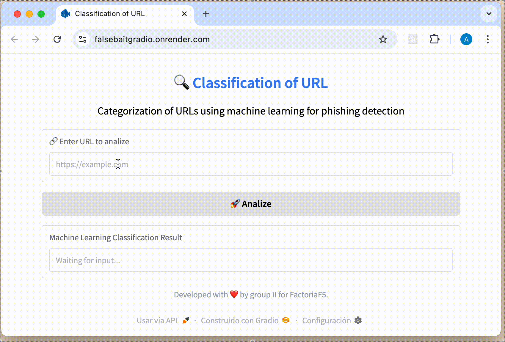

# 🔍 FalseBait: Detección de Phishing con Machine Learning


##  Índice

- [Acerca del Proyecto](#acerca-del-proyecto)
- [Características Principales](#características-principales)
- [Arquitectura del Sistema](#arquitectura-del-sistema)
- [Tecnologías Utilizadas](#tecnologías-utilizadas)
- [Dependencias](#dependencias)
- [Instalación y Uso](#instalación-y-uso)
- [API Endpoints](#api-endpoints)
- [Flujo de Clasificación de URLs](#flujo-de-clasificación-de-urls)
- [Posibles Mejoras](#posibles-mejoras)

---
## Acerca del Proyecto
<div align="justify">
FalseBait es una plataforma web que analiza y clasifica textos en función de su veracidad. El proyecto utiliza una arquitectura de microservicios con contenedores Docker, persistencia en Supabase, y despliegue en la nube mediante Render.

Cuenta con una funcionalidad clave: reentrenamiento automático del modelo con nuevas URLs insertadas por los usuarios, lo que permite una mejora progresiva del sistema. Además, incluye testeos de tipo unitarios, de integración y A/B.

</div>

Accede a la app online:
🔗 https://falsebaitgradio.onrender.com/

Accede a la api de FastApi:
🔗 https://falsebait-ake4.onrender.com/docs

Accede a documentación del proyecto: 
🔗 https://deepwiki.com/mr-melenas/FalseBait/1-overview

Accede a la presentación del proyecto:
🔗 https://gamma.app/docs/Sistema-de-Deteccion-de-Phishing-f2ludgict8ev676

---


---
## Características Principales

✅ **Interfaz Dual**: Acceso tanto a través de interfaz web (Gradio) como API (FastAPI)

✅ **Clasificación basada en ML**: Utiliza dos modelos para redundancia y precisión

✅ **Extracción de Características**: Analiza estructura de URL, propiedades de dominio y contenido

✅ **Almacenamiento de Resultados**: Guarda resultados de clasificación en base de datos Supabase

✅ **Análisis Profundo**: Extrae más de 40 características de cada URL para una clasificación precisa

✅ **Despliegue Containerizado**: Fácil despliegue mediante Docker y Docker Compose

✅ **Implementar Redes Neuronales**: El código se encuentra en fase de desarrollo

---
## Arquitectura del Sistema

```
POST /api/v1/predict → Web requests → Model prediction → extract_features_from_url() → save_fill_complete()

Usuario → Gradio UI (gradio_ui.py) → API Client → FastAPI Backend (main.py) → URL Predictor (scraping.py) → Web Scraper (scraping.py) → ML Models (model_clf_A.pkl, model_clf_B.pkl) → Supabase Database (supabase_db.py)
```


---
## Tecnologías Utilizadas


## Dependencias


---
## Instalación y Uso

### 1️⃣ Opción 1: Clonar el Repositorio
```bash
git clone https://github.com/mr-melenas/FalseBait
cd FalseBait
docker compose up --build
```
Esto iniciará tres servicios:
- Servicio Gradio UI: Expone la interfaz web en el puerto 7860
- Servicio FastAPI: Proporciona la API backend en el puerto 8000
- Servicio Test Runner: Ejecuta pruebas para verificar la funcionalidad del sistema

### 2️⃣ Opción 2: Usar la versión online
    Accede directamente a la aplicación en la nube:
    https://falsebaitgradio.onrender.com/

### 3️⃣ Opción 3: Ejecutar en local con Docker
Descargar las imágenes necesarias:
```
    docker pull yaelpc/falsebait-fastapi:v7  
    docker pull yaelpc/falsebait-gradio:v7  
    docker pull yaelpc/falsebait-tests:v7
```
Ejecutar los contenedores (ejemplo básico):
```
    docker run -d -p 8000:8000 yaelpc/falsebait-fastapi:v7  
    docker run -d -p 7860:7860 yaelpc/falsebait-gradio:v7 
```
Acceder a la app localmente:
http://127.0.0.1:7860

🆒 Para acceder al código de Redes Neuronales TensorFlow Keras:

🔗 https://colab.research.google.com/drive/1Jyn6W4FW8tLn6YF7f1onzf2GwSmvs6g9?usp=sharing

---
## API Endpoints
    https://falsebait-ake4.onrender.com/docs

### POST /api/v1/predict

Este endpoint acepta una URL y devuelve su clasificación como legítima, phishing o desconocida.

**Ejemplo de solicitud:**
```json
{
  "url": "https://example.com"
}
```

**Ejemplo de respuesta:**
```json
{
  "url": "https://example.com",
  "classification": "Legítimo"
}
```

---
## Flujo de Clasificación de URLs


---

## Posibles Mejoras

✅ Integrar datasets adicionales para obtener insights más profundos

✅ Desarrollar un pipeline automatizado para actualizaciones de datos

✅ Mejorar visualizaciones con dashboards interactivos

✅ Implementar modelos de machine learning para predicción de tendencias

✅ Añadir más características de análisis para mejorar la precisión

---

## Colaboradores

Este proyecto ha sido desarrollado por:

- Yael Parra  [Linkedin](https://www.linkedin.com/in/yael-parra/) [Github](https://github.com/Yael-Parra)
- Juan Carlos Macías [Linkedin](https://www.linkedin.com/in/juancarlosmacias/) [Github](https://github.com/juancmacias)
- Alla Haruty [Linkedin](https://www.linkedin.com/in/allaharuty/) [Github](https://github.com/alharuty)
- Max Beltran [Linkedin](https://www.linkedin.com/in/max-beltran/) [Github](https://github.com/mr-melenas)


Desarrollado con ❤️ por el grupo II para FactoriaF5.
